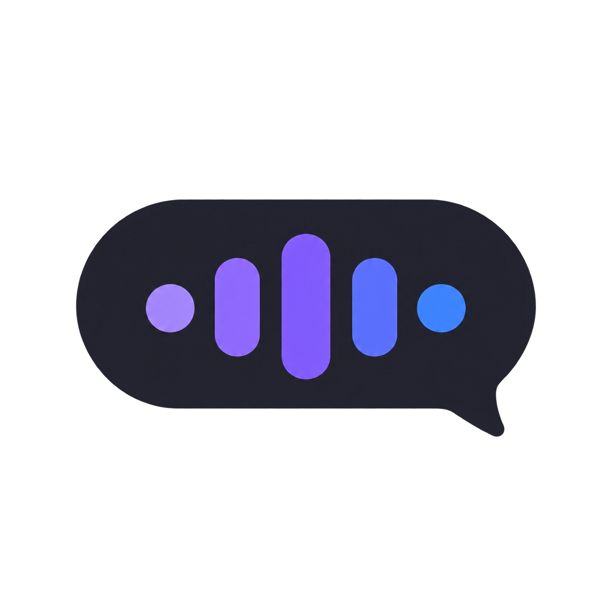

<p align="center"></p>

# Voice Dictate

Press **Right Alt**, speak, then press it again. Whisper transcribes on your Windows PC; your own Codex account cleans up the wording and the app pastes it into your active window.

If a window switch or mouse click interrupts the dictation, the floating pill keeps the finished text and shows **Copy**. Copy includes the entire transcript, even when the pill only shows its last few lines. **Esc** cancels a recording or dismisses recovered text.

Right Alt takes over **AltGr** on layouts that use it. On those layouts, change `VK_RMENU` in `dictate.py` to an unused key before starting the app.

## Install

1. Download this repository using **Code → Download ZIP**, then extract it to a folder you will keep.
2. Double-click **setup.cmd**. Choose a local Whisper model and sign in to **your own Codex account** in the browser.
3. Double-click the **Voice Dictate** shortcut the wizard creates on your desktop.

The default is the small English Whisper model on your CPU. An NVIDIA GPU option is available. Codex model access and usage limits depend on your account; the wizard lets you choose the rewrite model.

[Setup and troubleshooting](docs/SETUP.md) · [Let an AI assistant help](docs/AI-SETUP.md) · [Optional iPhone setup](docs/PHONE.md)

Phone dictation runs through your own private Tailscale network and requires your PC to stay awake. You create your own phone shortcut and keep its token private. The phone endpoint is off until you enable it during setup.

## Personal settings

Copy the examples to the repository root if you want a custom dictionary or writing style. Your local `settings.json`, `dictionary.txt`, and `style.md` are ignored by Git.

The optional settings window edits your vocabulary and style and shows recent dictations and usage:

```powershell
cd settings-app
npm ci
npm start
```

This Electron app keeps its existing npm lockfile; the setup wizard can install its dependencies for you.

## Your data

Whisper processes audio locally. Codex receives your transcript, vocabulary, writing notes, and the last 15 dictations as context for rewriting. This uses the account you sign into with the Codex CLI.

Raw and rewritten text is saved locally in `history.jsonl`. Routine timing logs omit transcript text, but errors, usage files, and clipboard contents can also be sensitive. These files, recordings, downloaded models, credentials, and phone tokens are excluded from this repository. Delete local history and logs when you no longer need them.

Phone uploads require a bearer token and have size, decode-time, and duration limits. Use your own Tailscale network. Keep Tailscale Funnel and public port forwarding disabled.

[Security policy](SECURITY.md) · [Security audit and release checks](docs/SECURITY-AUDIT.md)

## Development

Windows is required for the microphone, global hotkey, floating pill, and paste integration. Functional checks use dummy model and Windows calls:

```powershell
python test_recovery.py
python test_security.py
node settings-app/test_security.cjs
```

`test_copy_button.py` and `test_topmost.py` exercise the native pill. Run them only on an isolated desktop; the copy test temporarily uses the clipboard. They do not start Whisper or call Codex.

This is a fresh public snapshot. It does not include the original private repository's personal settings or runtime data.
